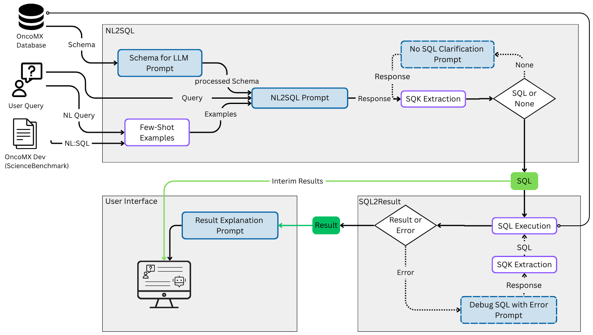

# Query carefully: Detecting the Unanswerables in NL2SQL

This repository contains the code implementation for the paper on handling unanswerable questions in Natural Language to SQL (NL2SQL) systems.

## Overview

This project implements a pipeline for processing natural language questions and converting them to SQL queries, with special focus on identifying and handling unanswerable question.

## Pipeline Diagram



## Repository Structure

- `src/` - Core implementation modules
    - `pipeline.py` - Main NL2SQL processing pipeline
    - `agents/` - Database and language model agents
    - `prompts/` - Prompt templates and management
    - `evaluation/` - Evaluation utilities
- `main.py` - Main execution script for answerable questions
- `main_unanswerables.py` - Execution script for unanswerable questions analysis
- `requirements.txt` - Python dependencies
- `data` - Data to unanswerable questions, readable schema, prompts

## Installation

1. Clone this repository
2. Install dependencies:
     ```bash
     pip install -r requirements.txt
     ```

## Usage

### Experiments 
#### OncoMX database

```bash
python main.py
```

#### unanswQ
```bash
python main_unanswerables.py
```

### User interface
```bash
streamlit run user_interface.py
```
Demo Video


## Citation

If you use this code in your research, please cite our paper:

```bibtex
[Paper in Review]
```

## License
This project is licensed under the MIT License. See the [LICENSE](LICENSE) file for details.